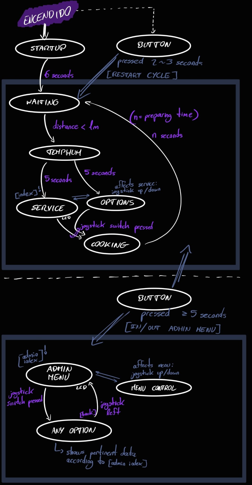

# Práctica 3 - Sistemas Empotrados y de Tiempo real

Apartados desarrollados :
* Implementación del modo servicio en su totalidad, pudiendo ejecutar en bucle permanente
* Funcionamiento correcto del botón para reiniciar el servicio
* Cambio al menú de administrador también por medio del botón 
* Opciones de temperatura y humedad, segundero y distancia de dicho menú

---

## ASPECTOS TÉCNICOS 

### Respecto al modo servicio

Para desarrollar la funcionalidad completa de la práctica he necesitado declarar y emplear un total de 10 threads. De esos, 7 pertenecen al control del arranque y el modo servicio que tiene el controlador. El loop principal de ejecución no sabe lo que pasa por dentro de cada cual, simplemente comprueba cuales se encuentran disponibles (o activos) en cada iteración y los pone a ejecutar. 

ACERCA DE LOS THREADS:
- Todos funcionan activándose y desactivándose unos a otros según el controlador cambia de estado
- Cada thread tiene su propio callback que ejecuta el código pertinente y se encarga de desactivarlo y activar a los siguientes en caso de ser necesario
- Tienen distintos intervalos entre ellos según aquello de lo que se encarguen (cuanto más reactivos he considerado que debieran ser menor es su intervalo y más iteraciones por segundo tendrán establecidas)
- El thread correspondiente al control del botón es "invisible" para el resto, dado que permanece activo desde el comienzo del programa pero ningún otro lo desactiva o interactúa con él en ningún momento. Por otra parte, este thread sí afecta a todos los demás dado que controla el reinicio del modo servicio y el cambio al menú de administrador.

Aquí podemos observar todos los threads empleados en la funcionalidad de arranque (únicamente el primer thread) y servicio

 
       

A pesar de todo, como ya hemos comentado antes, aunque incluya aquí el thread que controla los tiempos de pulsación del botón se podría decir que pertenece a ambas funcionalidades (servicio y menú de administrador). El motivo por el que está incluido aquí fue su temprana implementación.

ACERCA DE LOS CALLBACKS:
A continuación se explica brevemente qué hace cada uno de los callbacks relativos al arranque y servicio, acorde al thread al que pertenecen.
* **Callback startup** - enciende y apaga el led rojo hasta haber finalizado el tiempo de carga inicial. El mensaje de "CARGANDO..." que aparece en el lcd se imprime previamente en el *setup()* del controlador
* **Callback waiting** - imprime el mensaje de "ESPERANDO CLIENTE" la primera vez que ejecuta y en sus siguientes iteraciones queda esperando mientras mide la distancia que capta el sensor de ultrasonidos. Cuando la distancia es menor a un metro, pasa a la siguiente funcionalidad
* **Callback temphum** - imprime en el lcd la temperatura y humedad captadas (de forma no dinámica) y a los 5 segundos pasa a la siguiente funcionalidad
* **Callback service** - imprime en el lcd la opción que haya seleccionada de entre los productos posibles. Para esto hace empleo de una variable *index* que actualiza el callback de las opciones (explicado a continuación) y de dos listas, una con los nombres de productos y otra con los precios. También comprueba en cada iteración si ha sido pulsado el botón del joystick, en cuyo caso cambia de estado al siguiente
* **Callback options** - controla mediante el movimiento en el eje x del joystick la opción que se quiere seleccionar y actualiza la variable global *index* nombrada anteriormente. Detecta si se ha movido el joystick arriba o abajo según unos límites superior e inferior declarados como constantes globales
* **Callback cooking** - en su primera iteración establece un tiempo de preparación aleatorio entre 4 y 8 segundos. Acorde a este tiempo, ejecuta hasta que haya transcurrido el mismo a la vez que aumenta gradualmente la intensidad del led verde, encendiendo este poco a poco. Una vez finalizado el tiempo de preparación, imprime otro mensaje en el lcd mientras espera unos segundos más y retorna a la funcionalidad de servicio inicial (*callback waiting*)

Algunos de los callbacks nombrados aquí hacen empleo de funciones externas que explicaremos brevemente más adelante, dado que también conciernen a los threads del menú de administrador y sus relativos callbacks

---

### Respecto al menu de administrador

Su implementación ha precisado de únicamente el desarrollo de tres threads relativamente sencillos a comparación de los anteriores.
Como se menciona previamente, las funciones de las que hacen empleo los threads de este ciclo de estados, también se emplean en los callbacks de la funcionalidad de arranque y servicio, sin embargo aquí constituyen casi la totalidad de un callback y no es necesario completar tanto su funcionamiento.
La primera idea para el cambio al modo administrador fue emplear interrupciones, pero debido al funcionamiento de estas y a cómo había implementado las transiciones entre estados previamente en el resto de mi código, decidí hacerlo aquí de la misma manera por su sencillez.

TRANSICIÓN ENTRE MODOS:

El **callback button** mencionado pero no detallado antes se encarga de transicionar entre el ciclo de servicio y el menú de administrador en ambos sentidos, además de reiniciar el modo servicio en caso de ser necesario.

 
       

* **Reinicio** - La forma en que hace esto es por medio de comprobación de tiempos (para detectar si se pretende realizar una acción u otra) y posteriormente llamadas a funciones. En caso del reinicio de servicio llamaría a una función que reinicia todas las variables globales, para evitar conflictos con las mismas al reiniciar la ejecución de los threads, y posteriormente desactiva todos los threads de este modo, para únicamente reactivar el *waiting thread* 
* **Menú de administrador** - El cambio a este menú también comienza con una comprobación temporal, que permite cambiar el modo de funcionamiento activo al mantener pulsado el botón no menos de cinco segundos. Para realizar este cambio no es necesario comprobar si actualmente el controlador está en modo administrador o servicio, ya que lo hace una función externa al callback. Esta función reinicia todas las variables globales y también activa o desactiva los threads correspondientes. La diferencia con el reinicio es que aquí es el único momento en que se ven afectados los valores de *".enable"* de los threads relativos al modo administrador. En caso de activarse dicho modo, se permite la ejecución del thread del menú y el relativo al control del mismo, y en caso de desactivarse, se impide la ejecución de los mismos y retorna la permisividad del *waiting thread*, por lo que habría funcionado a grandes rasgos como un reinicio del servicio

---

### Otros detalles destacados

- Se ha implementado un watchdog en el código para mayor seguridad, el cual tiene un margen temporal de 8 segundos.
- Debido al diseño del código como una máquina de estados (con un ciclo de control cerrado) no se han empleado interrupciones, sino transiciones de estados en un mismo ciclo y entre lo que supondrían dos ciclos de estados distintos (ciclo de servicio y menú de administrador)

Podemos ver el bucle de ejecución diseñado en el siguiente diagrama:

 
       

---

## FUNCIONALIDAD COMPLETA

A continuación queda un vídeo en el que podemos ver el código empleado para la realización de la práctica en funcionamiento, en el que se muestra todo aquello explicado previamente:

* [**PLAY ME**](https://drive.google.com/file/d/1GvdBx9RgUvkxJeUrmiy5UgbD1E48CPPa/view?usp=sharing)

---

## AUTOR

Práctica llevada a cabo por el estudiante de la URJC:

* **Moisés Muñoz Suárez** - [mmunozs2020](https://github.com/mmunozs2020)

---

## Licencia

Proyecto protegido bajo licencia, para más detalles consultar el fichero [LICENSE](LICENSE) 

---
